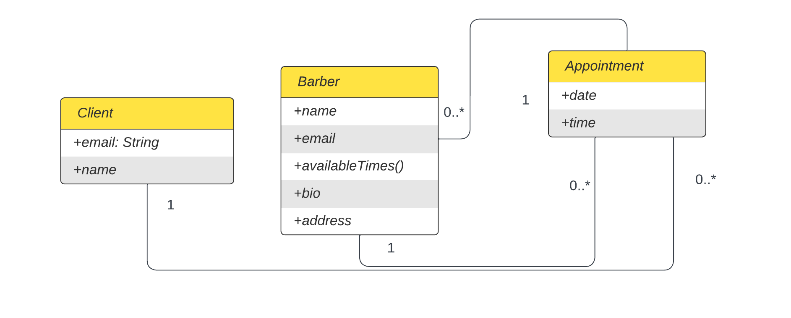

# FadeFinder

## Build Instructions

- Run `git clone <github-https-url>` (obtain the url from github) in a directory on your machine.

- After you pull run `npm install` in root project directory and /react-frontend and /expressjs-backend to get dependencies.

- Run `npm start` in /react-frontend to start the frontend and in /expressjs-backend to start the backend.

- `localhost:3000` and `localhost:5000` are where the frontend and backend are hosted on your machine respectively.

- Create a `.env` file in /expressjs-backend with the following variables: `MONGODB_URI` and `PORT`. Ask someone on the team to give you the values for these variables.

## Style

- See `UI_design-13.pdf` to see the first UI design

- Style guide used: React/JavaScript (airbnb).

- IDE plugins used: Visual Studio Code (ESlint, prettier); allow "Format on Save" option in IDE settings; `npm run format` in project root folder recursively formats .js, .jsx, .css, .md, .json files

## Class Diagram

- Appointments are outermost container for clients and barbers

- currently, clients are only stored in barber objects

## Testing

- run `npm test` in /expressjs-backend to run jest

- code converage is at 75% at time of writing